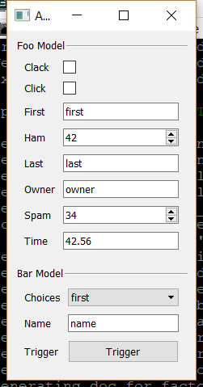

..
  NOTE: This RST file was generated by `make examples`.
  Do not edit it directly.
  See docs/source/examples/example_doc_generator.py

Advanced Example
===============================================================================

An advanced example of Enaml templates.

This example shows how Enaml templates can be used to automatically
generate the body of a form. Template specialization is used to select
the proper control for a model attribute at runtime. Template recursion
is then used to unroll a list of these controls into the body of a form.

.. TIP:: To see this example in action, download it from
 :download:`advanced <../../../examples/templates/advanced.enaml>`
 and run::

   $ enaml-run advanced.enaml

Screenshot
-------------------------------------------------------------------------------

Example Enaml Code
-------------------------------------------------------------------------------
.. literalinclude:: ../../../examples/templates/advanced.enaml
    :language: enaml
