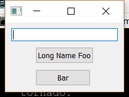

..
  NOTE: This RST file was generated by `make examples`.
  Do not edit it directly.
  See docs/source/examples/example_doc_generator.py

Align Example
===============================================================================

An example which demonstrates the use of the ``align`` layout helper.

In this example, we use the ``align`` layout helper to align various
constraints of the children of a container. The layout consists of
a Field pinned to the top of the Container. Below the Field are two
PushButtons each of which have their ``left`` boundary aligned. The
top PushButton is then aligned with the ``h_center`` of the Field.

.. TIP:: To see this example in action, download it from
 :download:`align <../../../examples/layout/basic/align.enaml>`
 and run::

   $ enaml-run align.enaml

Screenshot
-------------------------------------------------------------------------------

Example Enaml Code
-------------------------------------------------------------------------------
.. literalinclude:: ../../../examples/layout/basic/align.enaml
    :language: enaml
