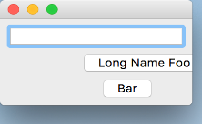

..
  NOTE: This RST file was generated by `make examples`.
  Do not edit it directly.
  See docs/source/examples/example_doc_generator.py

Align Offset Example
===============================================================================

An example of the ``align`` layout helper with inter-element offsets.

This is example is nearly identical to the `align.enaml` example. This
example adds to the other by showing how the ``align`` layout helper
accepts spacing offsets for its layout items.

.. TIP:: To see this example in action, download it from
 :download:`align_offset <../../../examples/layout/basic/align_offset.enaml>`
 and run::

   $ enaml-run align_offset.enaml

Screenshot
-------------------------------------------------------------------------------

Example Enaml Code
-------------------------------------------------------------------------------
.. literalinclude:: ../../../examples/layout/basic/align_offset.enaml
    :language: enaml
