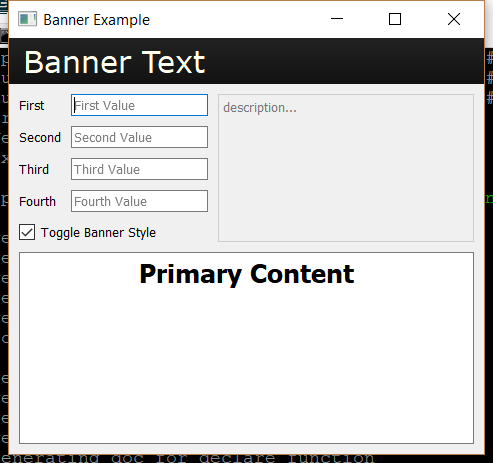

..
  NOTE: This RST file was generated by `make examples`.
  Do not edit it directly.
  See docs/source/examples/example_doc_generator.py

Banner Example
===============================================================================

An example of using style sheets to create a banner from a Label.

.. TIP:: To see this example in action, download it from
 :download:`banner <../../../examples/styling/banner.enaml>`
 and run::

   $ enaml-run banner.enaml

Screenshot
-------------------------------------------------------------------------------

Example Enaml Code
-------------------------------------------------------------------------------
.. literalinclude:: ../../../examples/styling/banner.enaml
    :language: enaml
