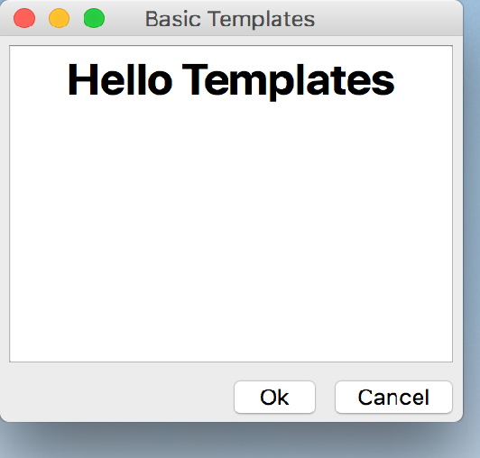

..
  NOTE: This RST file was generated by `make examples`.
  Do not edit it directly.
  See docs/source/examples/example_doc_generator.py

Basic Example
===============================================================================

A basic example of Enaml templates.

This example shows how Enaml templates can be used to define a control
"template" and then populate that template with user-defined widgets.

.. TIP:: To see this example in action, download it from
 :download:`basic <../../../examples/templates/basic.enaml>`
 and run::

   $ enaml-run basic.enaml

Screenshot
-------------------------------------------------------------------------------

Example Enaml Code
-------------------------------------------------------------------------------
.. literalinclude:: ../../../examples/templates/basic.enaml
    :language: enaml
