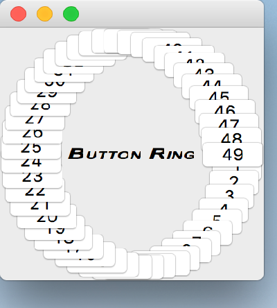

..
  NOTE: This RST file was generated by `make examples`.
  Do not edit it directly.
  See docs/source/examples/example_doc_generator.py

Button Ring Example
===============================================================================

An example layout which is impossible with typical layout systems.

This example creates a ring of 50 ``PushButton`` widgets with a ``Label`` in
the center. The constraints shown here are generally silly in that the
resulting layout is more-or-less useless. Nevertheless, it serves well to
demonstrate the power and flexibility of constraints-based layout.

Note that the 'gen_constraints' function is only called once, not on
every resize as may be expected when laying out widgets manually.

Note that this example also demonstrates that constraints may be defined
on any subclass of ``ConstraintsWidget``. They need not be confined to a
``Container``.

Requires numpy to be installed.

.. TIP:: To see this example in action, download it from
 :download:`button_ring <../../../examples/layout/advanced/button_ring.enaml>`
 and run::

   $ enaml-run button_ring.enaml

Screenshot
-------------------------------------------------------------------------------

Example Enaml Code
-------------------------------------------------------------------------------
.. literalinclude:: ../../../examples/layout/advanced/button_ring.enaml
    :language: enaml
