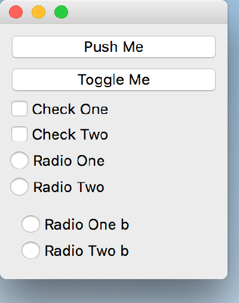

..
  NOTE: This RST file was generated by `make examples`.
  Do not edit it directly.
  See docs/source/examples/example_doc_generator.py

Buttons Example
===============================================================================

An example of the various button widgets in Enaml.

This example shows the usage of the ``PushButton``, ``CheckBox``, and
``RadioButton`` widgets.

The intent of this example is to demonstrate the use of the button
widgets. See the other examples for explanations of layout and other
language features.

.. TIP:: To see this example in action, download it from
 :download:`buttons <../../../examples/widgets/buttons.enaml>`
 and run::

   $ enaml-run buttons.enaml

Screenshot
-------------------------------------------------------------------------------

Example Enaml Code
-------------------------------------------------------------------------------
.. literalinclude:: ../../../examples/widgets/buttons.enaml
    :language: enaml
