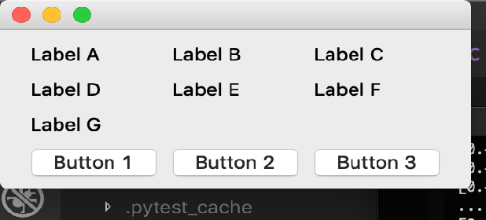

..
  NOTE: This RST file was generated by `make examples`.
  Do not edit it directly.
  See docs/source/examples/example_doc_generator.py

Centered Grid Example
===============================================================================

An example of how to express constraints with respect to helpers attributes

The layour in this example illustrates how to access and use the attributes of
helpers to complex layouts. All helpers expose the same attributes (left,
right, top, bottom, width, height, h_center, v_center) as any widget.

.. TIP:: To see this example in action, download it from
 :download:`centered_grid <../../../examples/layout/advanced/centered_grid.enaml>`
 and run::

   $ enaml-run centered_grid.enaml

Screenshot
-------------------------------------------------------------------------------

Example Enaml Code
-------------------------------------------------------------------------------
.. literalinclude:: ../../../examples/layout/advanced/centered_grid.enaml
    :language: enaml
