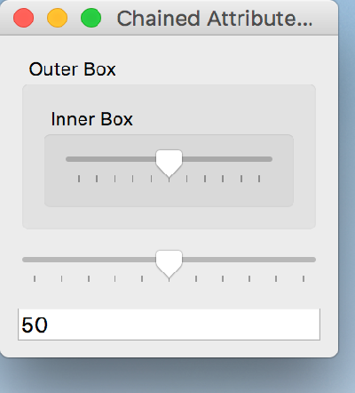

..
  NOTE: This RST file was generated by `make examples`.
  Do not edit it directly.
  See docs/source/examples/example_doc_generator.py

Chained Attribute Alias Example
===============================================================================

An example of using chained Enaml aliases.

This example is functionally equivalent to 'chained_widget_alias.enaml',
but it shows how the developer can exert more control over a widget by
exposing individual attributes instead of entire widgets.

.. TIP:: To see this example in action, download it from
 :download:`chained_attribute_alias <../../../examples/aliases/chained_attribute_alias.enaml>`
 and run::

   $ enaml-run chained_attribute_alias.enaml

Screenshot
-------------------------------------------------------------------------------

Example Enaml Code
-------------------------------------------------------------------------------
.. literalinclude:: ../../../examples/aliases/chained_attribute_alias.enaml
    :language: enaml
