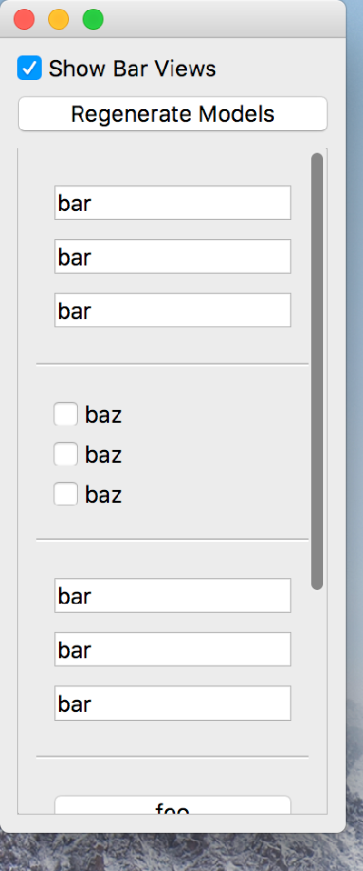

..
  NOTE: This RST file was generated by `make examples`.
  Do not edit it directly.
  See docs/source/examples/example_doc_generator.py

Conditional Example
===============================================================================

An example of using Conditional to generate the views.

This example shows how Conditional can be used to generate views for
objects which are not known until runtime.

.. TIP:: To see this example in action, download it from
 :download:`conditional <../../../examples/dynamic/conditional.enaml>`
 and run::

   $ enaml-run conditional.enaml

Screenshot
-------------------------------------------------------------------------------

Example Enaml Code
-------------------------------------------------------------------------------
.. literalinclude:: ../../../examples/dynamic/conditional.enaml
    :language: enaml
