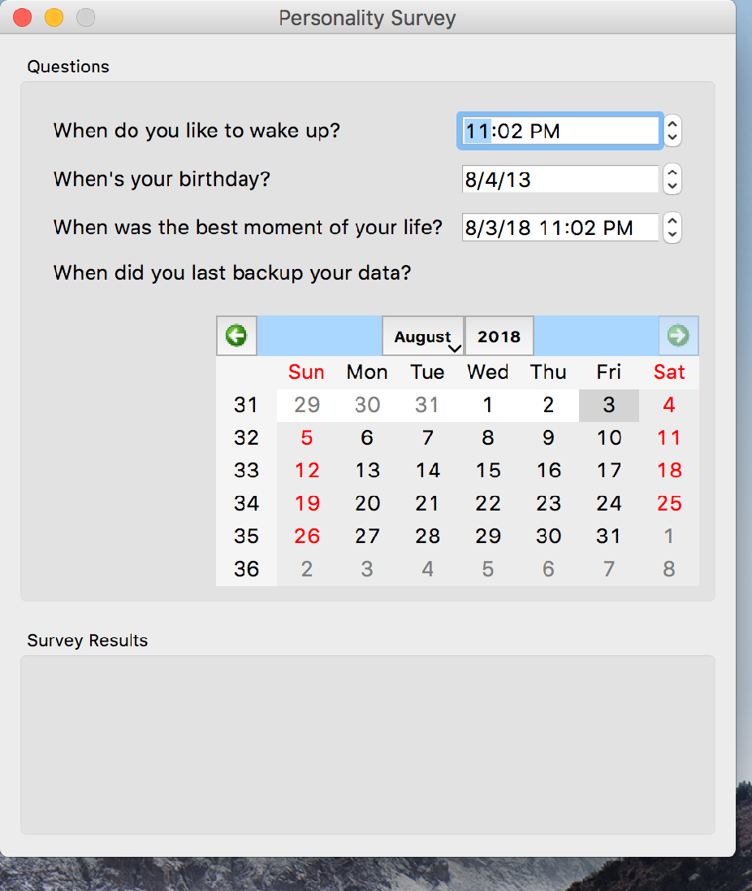

..
  NOTE: This RST file was generated by `make examples`.
  Do not edit it directly.
  See docs/source/examples/example_doc_generator.py

Dates Example
===============================================================================

Example demonstrating a number of date-related widgets.

Widgets include: ``datetime_selector``, ``date_selector``, ``time_selector`` and
``calendar``.

Asks the user some date-related questions, and gives a glib assessment of
their personality.

.. TIP:: To see this example in action, download it from
 :download:`dates <../../../examples/widgets/dates.enaml>`
 and run::

   $ enaml-run dates.enaml

Screenshot
-------------------------------------------------------------------------------

Example Enaml Code
-------------------------------------------------------------------------------
.. literalinclude:: ../../../examples/widgets/dates.enaml
    :language: enaml
