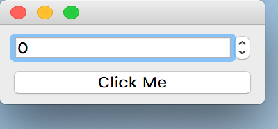

..
  NOTE: This RST file was generated by `make examples`.
  Do not edit it directly.
  See docs/source/examples/example_doc_generator.py

Declare Function Example
===============================================================================

An example which demonstrates the use of the ``func`` keyword.

Code in the body of the function has access to the same scope as a bound
expression. This consists of an implicity ``self`` which resolves to the
object on which the function was declared, as well as the identifiers
declared in the enclosing ``enamldef`` block. It also has access to the
dynamic scope which is rooted on ``self``.

.. TIP:: To see this example in action, download it from
 :download:`declare_function <../../../examples/functions/declare_function.enaml>`
 and run::

   $ enaml-run declare_function.enaml

Screenshot
-------------------------------------------------------------------------------

Example Enaml Code
-------------------------------------------------------------------------------
.. literalinclude:: ../../../examples/functions/declare_function.enaml
    :language: enaml
