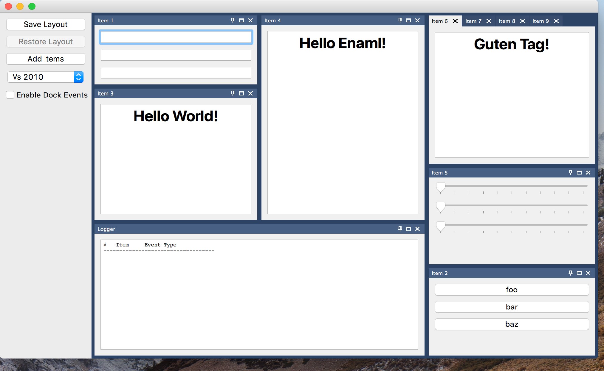

..
  NOTE: This RST file was generated by `make examples`.
  Do not edit it directly.
  See docs/source/examples/example_doc_generator.py

Dock Area Example
===============================================================================

This example demonstrates the use of the advanced DockArea widget.

The DockArea widget provides a canvas into which DockItems can be docked
and undocked at will. The layout configuration of the area can be saved
and restored using a layout object which can be easily pickled.

.. TIP:: To see this example in action, download it from
 :download:`dock_area <../../../examples/widgets/dock_area.enaml>`
 and run::

   $ enaml-run dock_area.enaml

Screenshot
-------------------------------------------------------------------------------

Example Enaml Code
-------------------------------------------------------------------------------
.. literalinclude:: ../../../examples/widgets/dock_area.enaml
    :language: enaml
