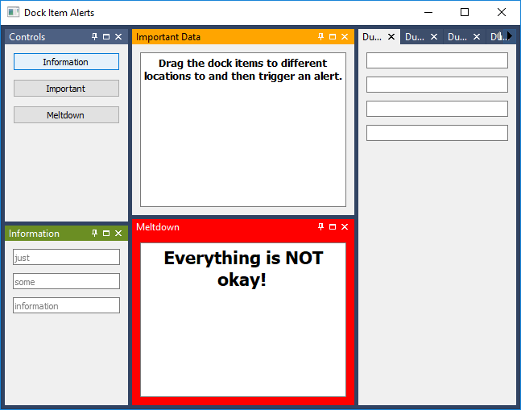

..
  NOTE: This RST file was generated by `make examples`.
  Do not edit it directly.
  See docs/source/examples/example_doc_generator.py

Dock Item Alerts Example
===============================================================================

This example demonstrates the use of alerts on the DockItem widget.

The DockItem widget and related bits in the DockArea support a style
sheet pseudo-class named 'alert'. This pseudo-class is very powerful in
that it allows the developer to provide their own arbitrary token to the
pseudo-class as an argument, and then apply that token to a dock item at
runtime. This gives the developer complete freedom over the how they style
their alerts, and does not force them in to a pre-defined hierarchy of
alert levels.

.. TIP:: To see this example in action, download it from
 :download:`dock_item_alerts <../../../examples/styling/dock_item_alerts.enaml>`
 and run::

   $ enaml-run dock_item_alerts.enaml

Screenshot
-------------------------------------------------------------------------------

Example Enaml Code
-------------------------------------------------------------------------------
.. literalinclude:: ../../../examples/styling/dock_item_alerts.enaml
    :language: enaml
