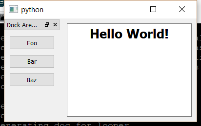

..
  NOTE: This RST file was generated by `make examples`.
  Do not edit it directly.
  See docs/source/examples/example_doc_generator.py

Dock Pane Example
===============================================================================

An example of the ``DockPane`` widget.

This example demonstrates the use of the ``DockPane`` widget. A ``DockPane``
can have at most one child, which must be a 'Container` widget. The
sizing of the ``DockPane`` is largely determined by the size constraints
of the child ``Container``. A ``DockPane`` must be used as the child of
a ``MainWindow``. There are several attribute on a ``DockPane`` which allow
the developer to control the behavior of the ``DockPane``.

Implementation Notes:

    The docking facilities in Wx are very weak. Due to various technical
    limitations, the sizing of ``DockPane`` widgets in Wx is not nearly as
    good as it is on Qt. The cost of using a ``DockPane`` in Wx is also
    *much* higher than in Qt due to Wx's horribly inefficient docking
    implementation. If docking is required for a particular application,
    strongly prefer the Qt backend over Wx (this is generally a good
    life-rule).

.. TIP:: To see this example in action, download it from
 :download:`dock_pane <../../../examples/widgets/dock_pane.enaml>`
 and run::

   $ enaml-run dock_pane.enaml

Screenshot
-------------------------------------------------------------------------------

Example Enaml Code
-------------------------------------------------------------------------------
.. literalinclude:: ../../../examples/widgets/dock_pane.enaml
    :language: enaml
