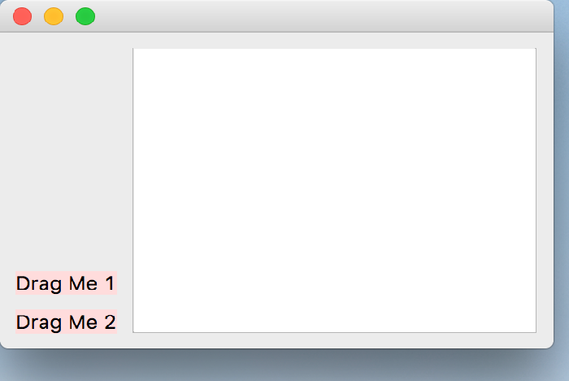

..
  NOTE: This RST file was generated by `make examples`.
  Do not edit it directly.
  See docs/source/examples/example_doc_generator.py

Drag And Drop Example
===============================================================================

An example of the drag and drop functionality.

In addition to the source widgets in this example, the drop target can
accept data from other processes that have draggable data, such as text
from a web page. The source drag data can also be dropped onto other
processes which support the 'text/plain' mime type used in this example.

The background color of the labels will update to indicate whether the
drop target accepted or rejected the proposed drop action.

If a widget has the ``DragEnabled`` Feature flag enabled, the following
declarative functions are available:

``drag_start``
    The start of the drag operation. Returns a DragData object.

``drag_end``
    The end of the drag operation. Indicates the result of the drop.

If a widget has the ``DropEnabled`` Feature flag enabled, the following
declarative functions are available:

``drag_enter``
    Called when a drag operation enters the widget bounds. The event
    must be accepted in order to receive further drag drop events.

``drag_move``
    Called when a drag operation moves within the widget bounds. This
    is normally not implemented, but it can be useful is certain cases.

``drag_leave``
    Called when a drag operation leaves the widget bounds.

``drop``
    Called when the drag data is dropped on the widget. The event
    can be ignored to indicated to the drag source that the event
    was not accepted. Set the drop action to DropAction.Ignore for
    that case. By default, the event is accepted.

.. TIP:: To see this example in action, download it from
 :download:`drag_and_drop <../../../examples/widgets/drag_and_drop.enaml>`
 and run::

   $ enaml-run drag_and_drop.enaml

Screenshot
-------------------------------------------------------------------------------

Example Enaml Code
-------------------------------------------------------------------------------
.. literalinclude:: ../../../examples/widgets/drag_and_drop.enaml
    :language: enaml
