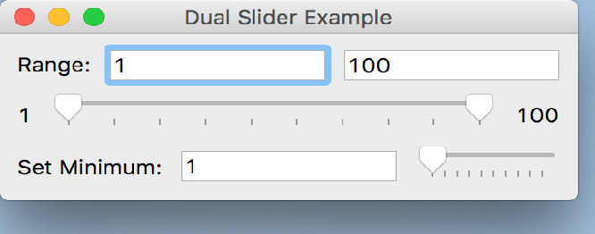

..
  NOTE: This RST file was generated by `make examples`.
  Do not edit it directly.
  See docs/source/examples/example_doc_generator.py

Dual Slider Example
===============================================================================

Example demonstrating a dual slider.

.. TIP:: To see this example in action, download it from
 :download:`dual_slider <../../../examples/widgets/dual_slider.enaml>`
 and run::

   $ enaml-run dual_slider.enaml

Screenshot
-------------------------------------------------------------------------------

Example Enaml Code
-------------------------------------------------------------------------------
.. literalinclude:: ../../../examples/widgets/dual_slider.enaml
    :language: enaml
