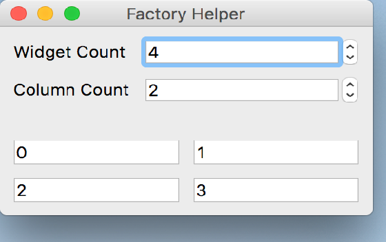

..
  NOTE: This RST file was generated by `make examples`.
  Do not edit it directly.
  See docs/source/examples/example_doc_generator.py

Factory Func Example
===============================================================================

An example of using a factory function to generate constraints.

This example shows how a function can be used as a delegate for generating
the list of layout constraints. This mode of constraint generation is useful
when the children of a container change dynamically at runtime. The factory
will be invoked automatically whenever the internal layout engine determines
that a relayout is necessary.

.. TIP:: To see this example in action, download it from
 :download:`factory_func <../../../examples/layout/advanced/factory_func.enaml>`
 and run::

   $ enaml-run factory_func.enaml

Screenshot
-------------------------------------------------------------------------------

Example Enaml Code
-------------------------------------------------------------------------------
.. literalinclude:: ../../../examples/layout/advanced/factory_func.enaml
    :language: enaml
