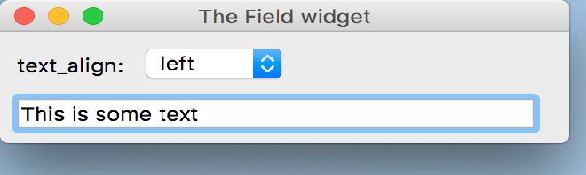

..
  NOTE: This RST file was generated by `make examples`.
  Do not edit it directly.
  See docs/source/examples/example_doc_generator.py

Field Example
===============================================================================

An example of the ``Field`` widget.

The ``Field`` is the most simple and common text input widget.

This example shows how to use the many properties of the ``Field`` widget.

.. TIP:: To see this example in action, download it from
 :download:`field <../../../examples/widgets/field.enaml>`
 and run::

   $ enaml-run field.enaml

Screenshot
-------------------------------------------------------------------------------

Example Enaml Code
-------------------------------------------------------------------------------
.. literalinclude:: ../../../examples/widgets/field.enaml
    :language: enaml
