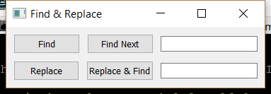

..
  NOTE: This RST file was generated by `make examples`.
  Do not edit it directly.
  See docs/source/examples/example_doc_generator.py

Find Replace Example
===============================================================================

An example demonstrating the layout for a find-replace dialog.

To make the buttons look nice, weak constraints are set requesting that
the adjacent buttons have the same width after satisfying all of the
other constraints. The left border of the Fields should be aligned. The
width taken up by the buttons is controlled by the lower row since the
PushButton labels "Replace" and "Replace & Find" take up more space than
"Find" and "Find Next". The lower row's buttons are not equal widths,
because that would take up a bunch of extra space, but the top row's
buttons do expand equally to take up the available space.

.. TIP:: To see this example in action, download it from
 :download:`find_replace <../../../examples/layout/advanced/find_replace.enaml>`
 and run::

   $ enaml-run find_replace.enaml

Screenshot
-------------------------------------------------------------------------------

Example Enaml Code
-------------------------------------------------------------------------------
.. literalinclude:: ../../../examples/layout/advanced/find_replace.enaml
    :language: enaml
