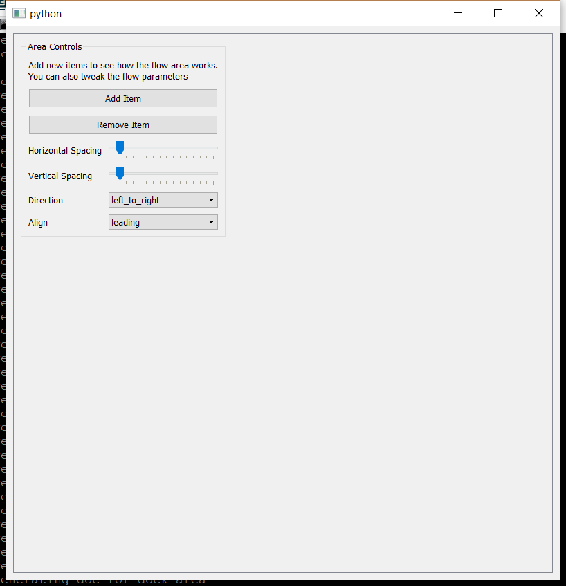

..
  NOTE: This RST file was generated by `make examples`.
  Do not edit it directly.
  See docs/source/examples/example_doc_generator.py

Flow Area Example
===============================================================================

An example of the ``FlowArea`` widget.

A ``FlowArea`` is a very powerful tool for creating a flowing layout of
widgets. A ``FlowArea`` accepts an arbitrary number of ``FlowItem`` children,
each of which holds a ``Container`` as its content. The layout of these
``FlowItem`` children is controlled by the ``FlowArea`` attributes:

    ``direction``
        This is an enum controlling how the items are arranged in the
        area. Allowable values are 'left_to_right', 'right_to_left',
        'top_to_bottom', and 'bottom_to_top'; and indicate the direction
        in which items will be added to the area. When the layout space
        in a given direction is exhausted, the layout will wrap around
        to the next line. With horizontal directions, lines are stacked
        top to bottom. With vertical directions, lines are stacked
        left to right.

    ``align``
        This is an enum controlling how a layout line is aligned within
        the layout space. If there is any space leftover after laying
        out a given line of widgets, that space is distributed according
        to the value of this enum. Allowable values are 'leading',
        'trailing', 'center', and 'justify'.

    ``horizontal_spacing``
        This is an int specifying how much horizontal space to place
        between items or lines in the layout.

    ``vertical_spacing``
        This is an int specifying how much vertical space to place
        between items or lines in the layout.

    ``margins``
        This is a Box of ints specifying how much margin to place
        on the outside of the layout.

Each ``FlowItem`` used in the layout can further customize the behavior:

    ``preferred_size``
        This is a Size specifying the desired layout size for the item.
        This size will be used whenever possible, but will not override
        the minimum or maximum size of the item. If set to (-1, -1)
        (the default), then the size hint for the item will be used.

    ``align``
        This is an enum which controls the orthogonal alignment of the
        item. When an item has neighbors which are larger than itself
        in the orhthongonal direction, this value controls how the item
        aligns within that additional space. The valid values area
        'leading', 'trailing', and 'center'.

    ``stretch``
        This is an int which controls the amount that the widget should
        expand to take up additional space in the layout direction. The
        default is 0 and means that the widget will not expand. When the
        value is greater than zero, the value is weighted against the
        stretch factors of the other items in the same line to determine
        the amount of space given to the item.

    ``ortho_stretch``
        This is an int which controls the amount that the widget should
        expand to take up additional space orthogonal to the layout
        direction. The default is 0 and means that the widget will not
        expand. If no item in a given line can expand in the ortho
        direction, then the line will not expand. Otherwise, the stretch
        factor for a line is equivalent to the maximum of the ortho
        stretch factors for all items in the line. The extra orthogonal
        space is then proportioned to the lines weighted on this stretch
        factor.

The code below creates a flow area populated with several initial flow
items. Items can be added and removed, and each individual item is
configurable. There is a single item which cannot be removed, and which
controls the parameters for the entire area.

.. TIP:: To see this example in action, download it from
 :download:`flow_area <../../../examples/widgets/flow_area.enaml>`
 and run::

   $ enaml-run flow_area.enaml

Screenshot
-------------------------------------------------------------------------------

Example Enaml Code
-------------------------------------------------------------------------------
.. literalinclude:: ../../../examples/widgets/flow_area.enaml
    :language: enaml
