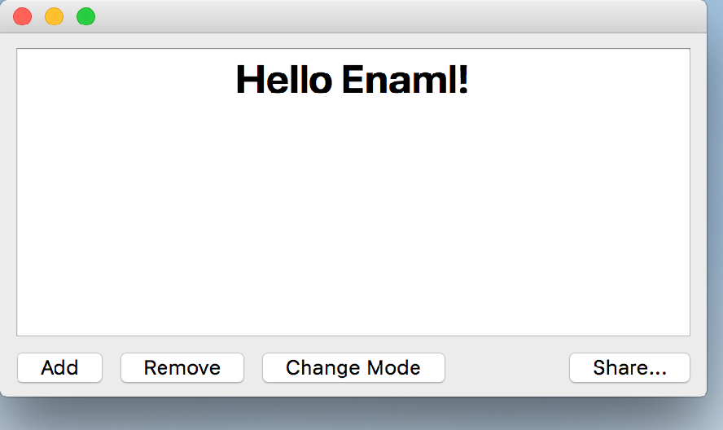

..
  NOTE: This RST file was generated by `make examples`.
  Do not edit it directly.
  See docs/source/examples/example_doc_generator.py

Fluid Example
===============================================================================

An example of how constraints can be used to create fluid layouts.

At the top of the layout is an ``Html`` widget which expands to fill the
available space. Below the ``Html`` are four ``PushButton`` widgets. On the
left are the Add and Remove buttons, which hug the left side of the window
and stay close to each other. Hugging the bottom right corner is the Share
``PushButton``. Centered is the Change Mode ``PushButton``. However, as the
window gets resized, the Change Mode button may not be able to be centered,
but it will always leave a gap between it and its two neighbors. This
type of behavior (selective centering) is difficult-if-not-impossible to
acheive with traditional box style layouts.

.. TIP:: To see this example in action, download it from
 :download:`fluid <../../../examples/layout/advanced/fluid.enaml>`
 and run::

   $ enaml-run fluid.enaml

Screenshot
-------------------------------------------------------------------------------

Example Enaml Code
-------------------------------------------------------------------------------
.. literalinclude:: ../../../examples/layout/advanced/fluid.enaml
    :language: enaml
