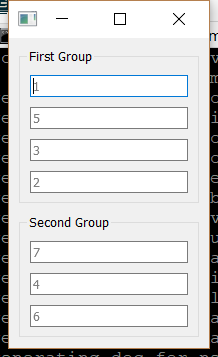

..
  NOTE: This RST file was generated by `make examples`.
  Do not edit it directly.
  See docs/source/examples/example_doc_generator.py

Focus Traversal Example
===============================================================================

An example of using the FocusTraversal advanced widget feature.

The FocusTraversal is an advanced widget feature for controlling the
order in which widgets receive focus during Tab and Shift+Tab keyboard
events. It enables two methods which can be implemented as declarative
Enaml functions which will compute the next/previous focus widgets on
demand.

In this example, the traversal handlers simply return the next or
previous field from a double-linked list of fields. However, there
is no restriction on how the handlers actually compute the focus
widgets.

.. TIP:: To see this example in action, download it from
 :download:`focus_traversal <../../../examples/widgets/focus_traversal.enaml>`
 and run::

   $ enaml-run focus_traversal.enaml

Screenshot
-------------------------------------------------------------------------------

Example Enaml Code
-------------------------------------------------------------------------------
.. literalinclude:: ../../../examples/widgets/focus_traversal.enaml
    :language: enaml
