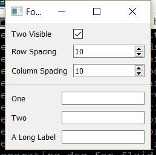

..
  NOTE: This RST file was generated by `make examples`.
  Do not edit it directly.
  See docs/source/examples/example_doc_generator.py

Form Spacing Example
===============================================================================

An example of controlling Form spacing.

The Form widget allows the developer to control the spacing between the
rows and columns in the form. Changes to the row and column spacing at
runtime are automatically reflected in the layout.

.. TIP:: To see this example in action, download it from
 :download:`form_spacing <../../../examples/widgets/form_spacing.enaml>`
 and run::

   $ enaml-run form_spacing.enaml

Screenshot
-------------------------------------------------------------------------------

Example Enaml Code
-------------------------------------------------------------------------------
.. literalinclude:: ../../../examples/widgets/form_spacing.enaml
    :language: enaml
