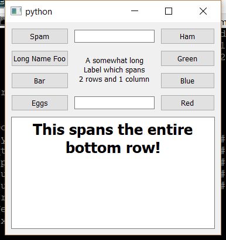

..
  NOTE: This RST file was generated by `make examples`.
  Do not edit it directly.
  See docs/source/examples/example_doc_generator.py

Grid Example
===============================================================================

An example which demonstrates the use of the ``grid`` layout helper.

In this example, we use the ``grid`` layout helper to layout the children
of the Container in a grid arrangment. Similar to the ``vbox`` and ``hbox``
functions, the ``grid`` function will automatically take into account the
the content boundaries of its parent and provides the necessary layout
spacers to arrange things nicely.

The ``grid`` function allows items to span multiple cells by assigning the
same item to multiple cells. No checks are performed to ensure an item
spans a continugous cell block. Instead, items will span the smallest
rectangular cell block which encloses all of its locations. Empty cells
are defined by using ``None`` as the cell item.

Inter-row and inter-column spacing of the grid is controlled with the
``row_spacing`` and ``column_spacing`` keyword arguments both of which
default to 10.

Addition row and and column alignment constraints can be supplied with
the ``row_align`` and ``column_align`` keyword arguments. These are strings
which are supplied to the ``align`` layout helper for the items in a given
row or column. However, these constraints are only applied to items which
span a single row or column, respectively.

.. TIP:: To see this example in action, download it from
 :download:`grid <../../../examples/layout/basic/grid.enaml>`
 and run::

   $ enaml-run grid.enaml

Screenshot
-------------------------------------------------------------------------------

Example Enaml Code
-------------------------------------------------------------------------------
.. literalinclude:: ../../../examples/layout/basic/grid.enaml
    :language: enaml
