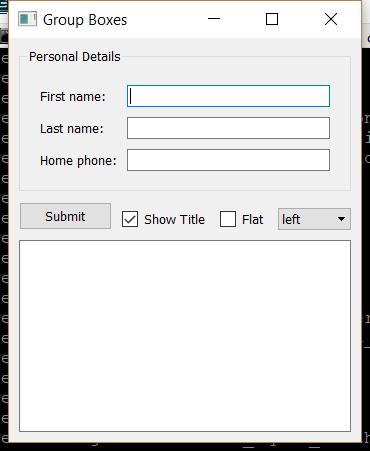

..
  NOTE: This RST file was generated by `make examples`.
  Do not edit it directly.
  See docs/source/examples/example_doc_generator.py

Group Box Example
===============================================================================

An example of the ``GroupBox`` widget.

A ``GroupBox`` is a simple subclass of ``Container`` which draws itself with
an optional bounding box and title.

.. TIP:: To see this example in action, download it from
 :download:`group_box <../../../examples/widgets/group_box.enaml>`
 and run::

   $ enaml-run group_box.enaml

Screenshot
-------------------------------------------------------------------------------

Example Enaml Code
-------------------------------------------------------------------------------
.. literalinclude:: ../../../examples/widgets/group_box.enaml
    :language: enaml
