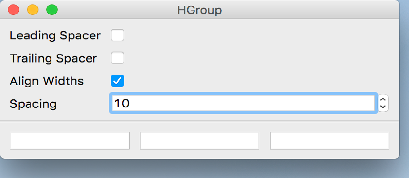

..
  NOTE: This RST file was generated by `make examples`.
  Do not edit it directly.
  See docs/source/examples/example_doc_generator.py

H Group Example
===============================================================================

An example of the ``HGroup`` convenience container.

The HGroup is a convenience container which provides a simple horizontal
group of child widgets, with knobs to control inter-widget spacing, leading
and trailing spacers, and width alignment.

.. TIP:: To see this example in action, download it from
 :download:`h_group <../../../examples/widgets/h_group.enaml>`
 and run::

   $ enaml-run h_group.enaml

Screenshot
-------------------------------------------------------------------------------

Example Enaml Code
-------------------------------------------------------------------------------
.. literalinclude:: ../../../examples/widgets/h_group.enaml
    :language: enaml
