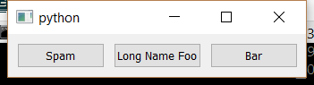

..
  NOTE: This RST file was generated by `make examples`.
  Do not edit it directly.
  See docs/source/examples/example_doc_generator.py

Hbox Equal Widths Example
===============================================================================

An example of the ``hbox`` layout helper with auxiliary constraints.

This example is nearly identical to the `hbox.enaml` example. However,
this time we add some auxiliary constraints to make the buttons equal
widths. When resizing the window, each button is therefore guaranteed
to expand by the same amount.

.. TIP:: To see this example in action, download it from
 :download:`hbox_equal_widths <../../../examples/layout/basic/hbox_equal_widths.enaml>`
 and run::

   $ enaml-run hbox_equal_widths.enaml

Screenshot
-------------------------------------------------------------------------------

Example Enaml Code
-------------------------------------------------------------------------------
.. literalinclude:: ../../../examples/layout/basic/hbox_equal_widths.enaml
    :language: enaml
