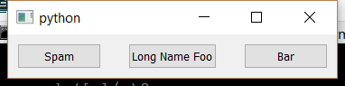

..
  NOTE: This RST file was generated by `make examples`.
  Do not edit it directly.
  See docs/source/examples/example_doc_generator.py

Hbox Spacing Example
===============================================================================

An example of the ``hbox`` layout helper with inter-element spacing.

This example is nearly identical to the `hbox.enaml` example. However,
this time we change the default inter-element spacing from 10 to 30.

.. TIP:: To see this example in action, download it from
 :download:`hbox_spacing <../../../examples/layout/basic/hbox_spacing.enaml>`
 and run::

   $ enaml-run hbox_spacing.enaml

Screenshot
-------------------------------------------------------------------------------

Example Enaml Code
-------------------------------------------------------------------------------
.. literalinclude:: ../../../examples/layout/basic/hbox_spacing.enaml
    :language: enaml
