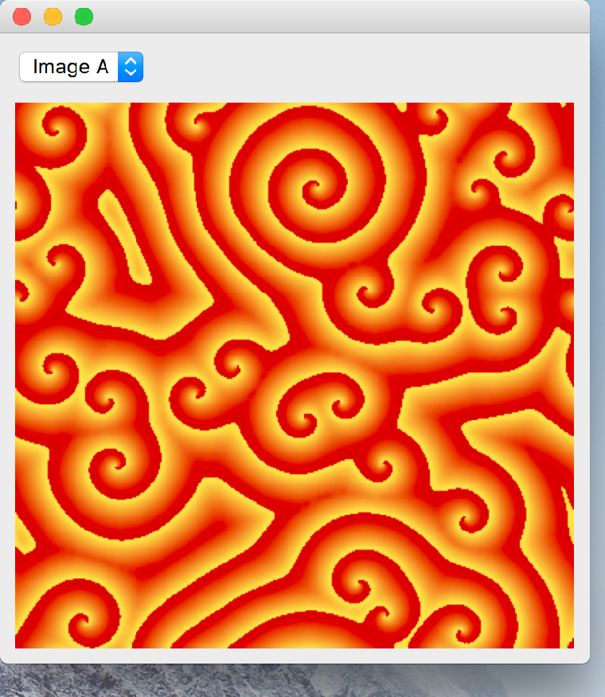

..
  NOTE: This RST file was generated by `make examples`.
  Do not edit it directly.
  See docs/source/examples/example_doc_generator.py

Image View Example
===============================================================================

An example of the ``ImageView`` widget.

This example shows how a PNG image (in an enaml Image object) can displayed.

.. TIP:: To see this example in action, download it from
 :download:`image_view <../../../examples/widgets/image_view.enaml>`
 and run::

   $ enaml-run image_view.enaml

Screenshot
-------------------------------------------------------------------------------

Example Enaml Code
-------------------------------------------------------------------------------
.. literalinclude:: ../../../examples/widgets/image_view.enaml
    :language: enaml
