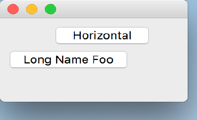

..
  NOTE: This RST file was generated by `make examples`.
  Do not edit it directly.
  See docs/source/examples/example_doc_generator.py

Linear Relations Example
===============================================================================

An example which demonstrates linear relational constraints.

This example shows how one may define a constraint as a linear relation
of some other constraint. In this example, the horizontal position and
width of a ``PushButton`` depends up the width of the ``Container``, and the
vertical position of another ``PushButton`` depends upon the width of the
other ``PushButton``.

This is a contrieved example, but serves to demonstrate the feature.

.. TIP:: To see this example in action, download it from
 :download:`linear_relations <../../../examples/layout/basic/linear_relations.enaml>`
 and run::

   $ enaml-run linear_relations.enaml

Screenshot
-------------------------------------------------------------------------------

Example Enaml Code
-------------------------------------------------------------------------------
.. literalinclude:: ../../../examples/layout/basic/linear_relations.enaml
    :language: enaml
