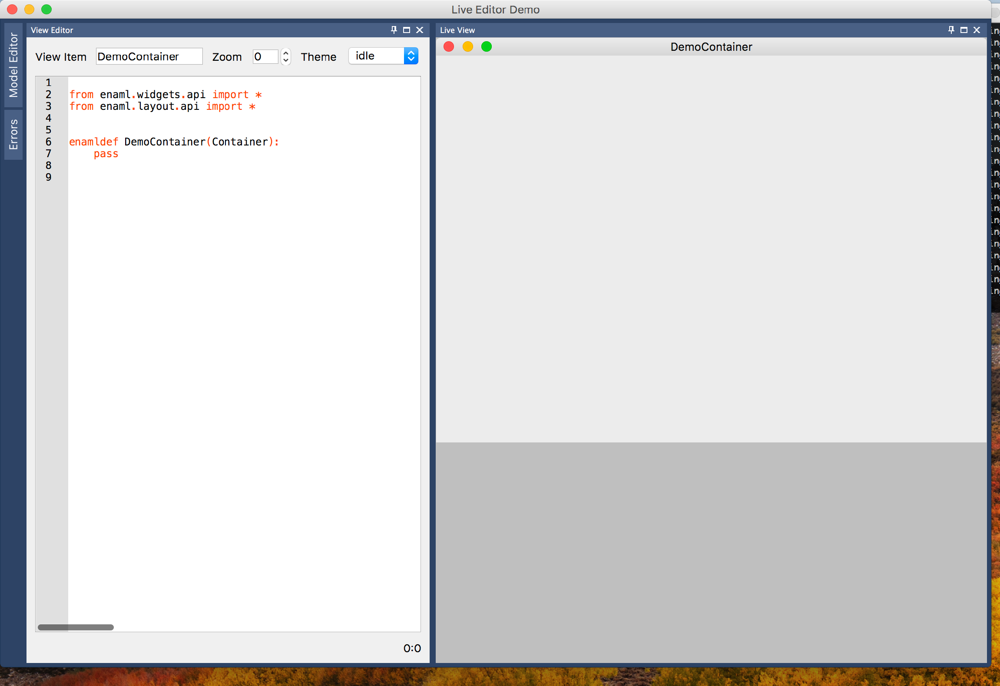

..
  NOTE: This RST file was generated by `make examples`.
  Do not edit it directly.
  See docs/source/examples/example_doc_generator.py

Live Editor Example
===============================================================================

An example of using the live editor applib components.

This examples shows how the various applib live editor components can be
stitched together to form a live Enaml code editor application.

.. TIP:: To see this example in action, download it from
 :download:`live_editor <../../../examples/applib/live_editor.enaml>`
 and run::

   $ enaml-run live_editor.enaml

Screenshot
-------------------------------------------------------------------------------

Example Enaml Code
-------------------------------------------------------------------------------
.. literalinclude:: ../../../examples/applib/live_editor.enaml
    :language: enaml
