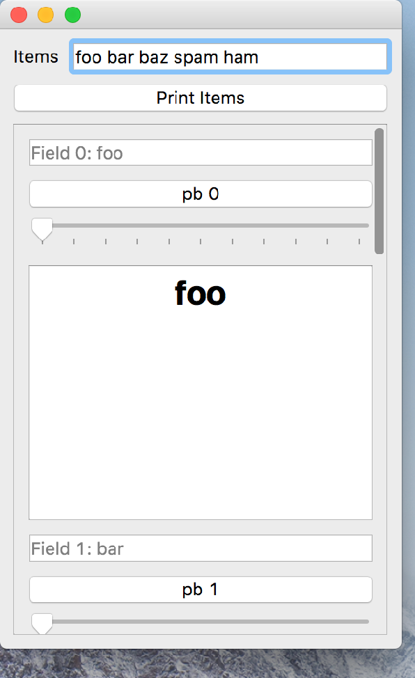

..
  NOTE: This RST file was generated by `make examples`.
  Do not edit it directly.
  See docs/source/examples/example_doc_generator.py

Looper Example
===============================================================================

An example of using Looper to generate widgets from an iterable.

.. TIP:: To see this example in action, download it from
 :download:`looper <../../../examples/dynamic/looper.enaml>`
 and run::

   $ enaml-run looper.enaml

Screenshot
-------------------------------------------------------------------------------

Example Enaml Code
-------------------------------------------------------------------------------
.. literalinclude:: ../../../examples/dynamic/looper.enaml
    :language: enaml
