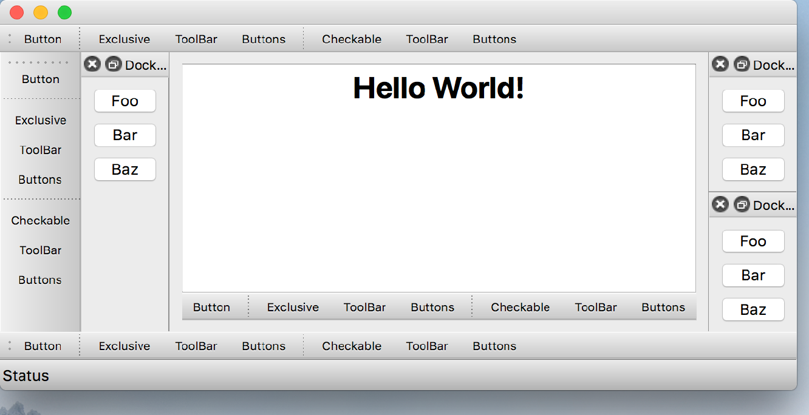

..
  NOTE: This RST file was generated by `make examples`.
  Do not edit it directly.
  See docs/source/examples/example_doc_generator.py

Main Window Example
===============================================================================

An example of the ``MainWindow`` widget.

This example demonstrates the use of the ``MainWindow`` widget. This is a
subclass of the ``Window`` widget which adds support for dock panes, tool
bars and a menu bar. The children of a ``MainWindow`` can be defined in
any order. Like ``Window``, a ``MainWindow`` has at most one central widget
which is an instance of ``Container``. A ``MainWindow`` can have any number
of ``DockPane`` and ``ToolBar`` children, and at most one ``MenuBar``.

Support for a ``StatusBar`` will be added in the future.

.. TIP:: To see this example in action, download it from
 :download:`main_window <../../../examples/widgets/main_window.enaml>`
 and run::

   $ enaml-run main_window.enaml

Screenshot
-------------------------------------------------------------------------------

Example Enaml Code
-------------------------------------------------------------------------------
.. literalinclude:: ../../../examples/widgets/main_window.enaml
    :language: enaml
