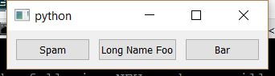

..
  NOTE: This RST file was generated by `make examples`.
  Do not edit it directly.
  See docs/source/examples/example_doc_generator.py

Manual Hbox Example
===============================================================================

An example which demonstrates the manual specification of an ``hbox``.

This example demonstrates how one would manually define the constraints
for an ``hbox`` style layout. In fact, the ``hbox`` layout helper generates
the primitive constraints in a fashion very similar to this example.
The intent of this example is to demonstrate that all of the layout
helper functions can be distilled down to a list of primitive
constraints.

.. TIP:: To see this example in action, download it from
 :download:`manual_hbox <../../../examples/layout/advanced/manual_hbox.enaml>`
 and run::

   $ enaml-run manual_hbox.enaml

Screenshot
-------------------------------------------------------------------------------

Example Enaml Code
-------------------------------------------------------------------------------
.. literalinclude:: ../../../examples/layout/advanced/manual_hbox.enaml
    :language: enaml
