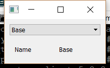

..
  NOTE: This RST file was generated by `make examples`.
  Do not edit it directly.
  See docs/source/examples/example_doc_generator.py

Mapped View Example
===============================================================================

An example of using the Enaml stdlib ``MappedView`` component.

The ``MappedView`` is an enamldef subtype of the ``Include`` type which will
automatically create a view for an object based on it's type and a given
typemap. See the documentation for ``MappedView`` for a full description.

In this example, a simple class hierarchy is created. For each type in
the hierararchy, a custom view is created. These views are provided as
a typemap to a ``MappedView`` so that when a given object is selected, the
proper view is displayed.

.. TIP:: To see this example in action, download it from
 :download:`mapped_view <../../../examples/stdlib/mapped_view.enaml>`
 and run::

   $ enaml-run mapped_view.enaml

Screenshot
-------------------------------------------------------------------------------

Example Enaml Code
-------------------------------------------------------------------------------
.. literalinclude:: ../../../examples/stdlib/mapped_view.enaml
    :language: enaml
