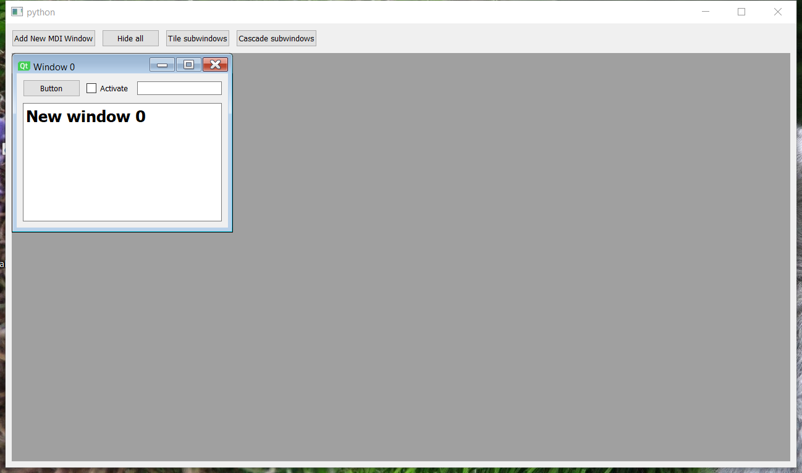

..
  NOTE: This RST file was generated by `make examples`.
  Do not edit it directly.
  See docs/source/examples/example_doc_generator.py

Mdi Area Example
===============================================================================

An example of the ``MdiArea`` and ``MdiWindow`` widget.

Demonstrate how to use the MdiArea which provides an area in which multiple
subwindows can be displayed (MdiWindow instances). Sub windows can be
automatically tiled or cascaded.

.. TIP:: To see this example in action, download it from
 :download:`mdi_area <../../../examples/widgets/mdi_area.enaml>`
 and run::

   $ enaml-run mdi_area.enaml

Screenshot
-------------------------------------------------------------------------------

Example Enaml Code
-------------------------------------------------------------------------------
.. literalinclude:: ../../../examples/widgets/mdi_area.enaml
    :language: enaml
