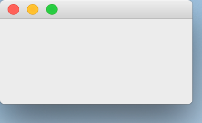

..
  NOTE: This RST file was generated by `make examples`.
  Do not edit it directly.
  See docs/source/examples/example_doc_generator.py

Menu Bar Example
===============================================================================

An example of the ``MenuBar`` widget.

This example demonstrates the use of the ``MenuBar`` widget. A ``MenuBar``
can have an arbitrary number of children, which must be ``Menu`` widgets.
A ``Menu`` can have an arbitrary number of children which must be ``Menu``
widgets or ``Action`` widgets. An ``Menu`` child becomes a submenu, and an
``Action`` is represented as a clickable menu item. A ``MenuBar`` must be
used as the child of a ``MainWindow``.

This example also demonstrates the ``ActionGroup`` widget. An ``ActionGroup``
is used logically group multiple ``Action`` widgets together. Changes to
the ``enabled`` or ``visible`` state of the ``ActionGroup`` apply to all of the
``Action`` widgets in that group. Additionally, the ``ActionGroup`` is the
primary means of making ``Action`` widgets exclusive. The default behavior
of the group is to make all child ``Action`` widgets mutually exclusive.
This can be disabled by setting `exclusive = False` on the ``ActionGroup``.

.. TIP:: To see this example in action, download it from
 :download:`menu_bar <../../../examples/widgets/menu_bar.enaml>`
 and run::

   $ enaml-run menu_bar.enaml

Screenshot
-------------------------------------------------------------------------------

Example Enaml Code
-------------------------------------------------------------------------------
.. literalinclude:: ../../../examples/widgets/menu_bar.enaml
    :language: enaml
