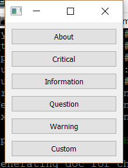

..
  NOTE: This RST file was generated by `make examples`.
  Do not edit it directly.
  See docs/source/examples/example_doc_generator.py

Message Box Example
===============================================================================

An example of using the Enaml stdlib MessageBox.

The MessageBox element is built on top of the stdlib task dialog elements.
See the ``task_dialog`` example for a demonstration of those elements.

This example shows how to use the MessageBox directly along with various
convenience functions which are available for 1-line notifications.

.. TIP:: To see this example in action, download it from
 :download:`message_box <../../../examples/stdlib/message_box.enaml>`
 and run::

   $ enaml-run message_box.enaml

Screenshot
-------------------------------------------------------------------------------

Example Enaml Code
-------------------------------------------------------------------------------
.. literalinclude:: ../../../examples/stdlib/message_box.enaml
    :language: enaml
