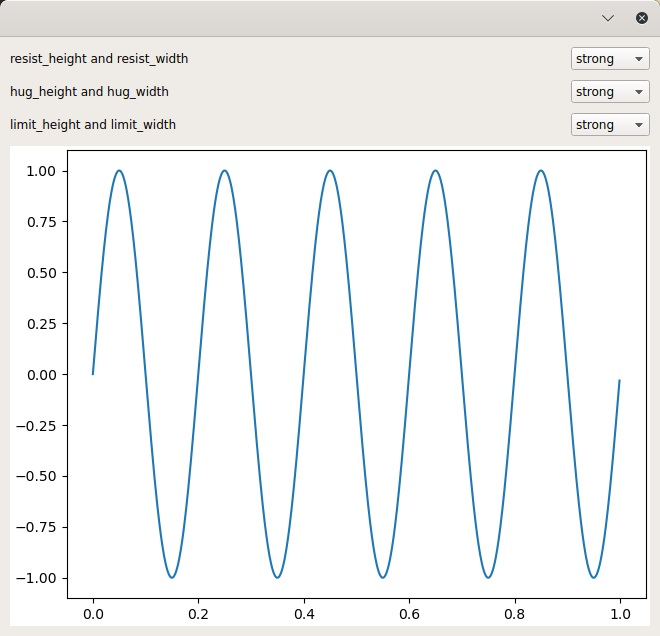

..
  NOTE: This RST file was generated by `make examples`.
  Do not edit it directly.
  See docs/source/examples/example_doc_generator.py

Mpl Canvas Size Example
===============================================================================

An example of how to override tolkit-supplied size hints on your widget.

The toolkit-supplied size hint for MPLCanvas is 480 x 640 pixels, which
prevents you from sizing the canvas smaller. This can be a problem when you are
presenting a large grid of Matplotlib figures.

This example demonstrates how to override the tookit-supplied size hint for
MPLCanvas. By setting resist_width, resist_height, hug_height, and hug_width to
'ignore', you can resize the figure almost freely in any direction.

This serves to demonstrate how the resist, hug and limit constraints interact
to control the size of a widget.

resist:
    If "strong", the widget will not shrink smaller than the preferred size
    (i.e., the constraint `width >= width_hint` or `height >= height_hint` is
    set on the object).

hug:
    If "strong", the widget will not change from the preferred size (i.e., the
    constraint `width == width_hint` or `height == height_hint` is set on the
    object).

limit:
    If "strong", the widget will not expand larger than the preferred size
    (i.e., the constraint `width <= width_hint` and `height <= height_hint` is
    set on the object).

To allow a MPLCanvas to shrink smaller than the default size but not expand
larger:

    resist = ignore or weak
    hug = ignore or weak
    limit = strong

To allow a MPLCanvas to expand larger than the default size but not shrink
smaller:

    resist = strong
    hug = ignore or weak
    limit = ignore or weak

To disallow a MPLCanvas to change in size:

    resist = strong, ignore or weak
    hug = strong
    limit = strong, ignore or weak

.. TIP:: To see this example in action, download it from
 :download:`mpl_canvas_size <../../../examples/layout/advanced/mpl_canvas_size.enaml>`
 and run::

   $ enaml-run mpl_canvas_size.enaml

Screenshot
-------------------------------------------------------------------------------

Example Enaml Code
-------------------------------------------------------------------------------
.. literalinclude:: ../../../examples/layout/advanced/mpl_canvas_size.enaml
    :language: enaml
