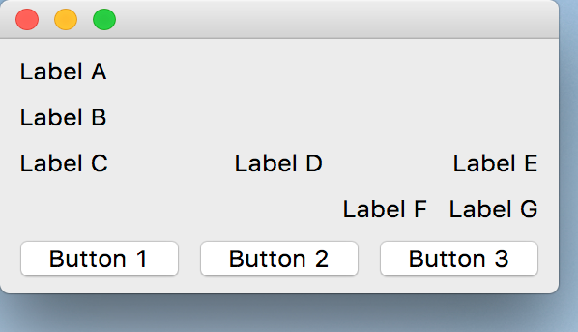

..
  NOTE: This RST file was generated by `make examples`.
  Do not edit it directly.
  See docs/source/examples/example_doc_generator.py

Nested Boxes Example
===============================================================================

An example of how the ``hbox`` and ``vbox`` layout helpers can be nested.

The layout in this example is not necessarily one that would be used
in a production application. However, it serves to demonstrate the idea
that the ``hbox`` and ``vbox`` layout helpers can be arbitrarily nested.

.. TIP:: To see this example in action, download it from
 :download:`nested_boxes <../../../examples/layout/advanced/nested_boxes.enaml>`
 and run::

   $ enaml-run nested_boxes.enaml

Screenshot
-------------------------------------------------------------------------------

Example Enaml Code
-------------------------------------------------------------------------------
.. literalinclude:: ../../../examples/layout/advanced/nested_boxes.enaml
    :language: enaml
