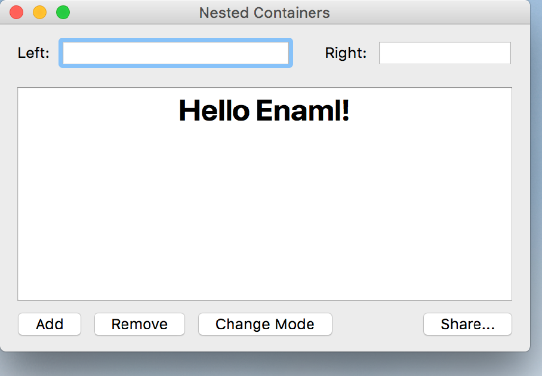

..
  NOTE: This RST file was generated by `make examples`.
  Do not edit it directly.
  See docs/source/examples/example_doc_generator.py

Nested Containers Example
===============================================================================

An example showing the unified layout across nested Containers.

There are three Containers under the window, two sharing space on top and
one taking up the entire horizontal space on the bottom. The two on top
simply consist of a Label and a Field. The Container on the left is
constrained to be slightly larger than the other by a constant multiplier.

The Container on the bottom contains the more complicated example from
`fluid.enaml` to demonstrate that a complicated layout works inside
a nested Container, too.

.. TIP:: To see this example in action, download it from
 :download:`nested_containers <../../../examples/layout/advanced/nested_containers.enaml>`
 and run::

   $ enaml-run nested_containers.enaml

Screenshot
-------------------------------------------------------------------------------

Example Enaml Code
-------------------------------------------------------------------------------
.. literalinclude:: ../../../examples/layout/advanced/nested_containers.enaml
    :language: enaml
