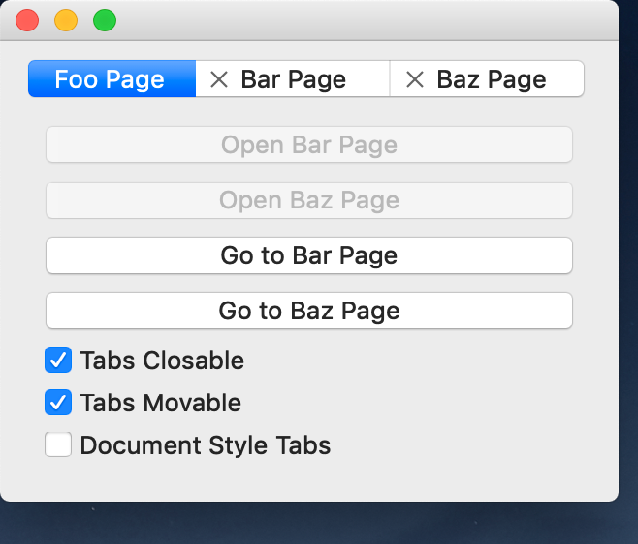

..
  NOTE: This RST file was generated by `make examples`.
  Do not edit it directly.
  See docs/source/examples/example_doc_generator.py

Notebook Example
===============================================================================

An example of the ``Notebook`` widget.

This example demonstrates the use of the ``Notebook`` widget. A ``Notebook``
displays its children as a tabbed control, where one child is visible
at a time. The children of a ``Notebook`` must be instances of ``Page`` and
parent of a ``Page`` must be a ``Notebook``. A ``Page`` can have at most one
child which must be an instance of ``Container``. This ``Container`` is
expanded to fill the available space in the page. A ``Notebook`` is layed
out using constraints just like normal constraints enabled widgets.

Implementation Notes:

    Changing the tab style of the ``Notebook`` dynamically is not
    supported on Wx. Close buttons on tabs is not supported on
    Wx when using the 'preferences' tab style.

.. TIP:: To see this example in action, download it from
 :download:`notebook <../../../examples/widgets/notebook.enaml>`
 and run::

   $ enaml-run notebook.enaml

Screenshot
-------------------------------------------------------------------------------

Example Enaml Code
-------------------------------------------------------------------------------
.. literalinclude:: ../../../examples/widgets/notebook.enaml
    :language: enaml
