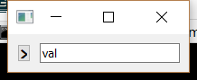

..
  NOTE: This RST file was generated by `make examples`.
  Do not edit it directly.
  See docs/source/examples/example_doc_generator.py

Observe Model Signal Example
===============================================================================

An example which demonstrates how to observe a model signal.

This examples uses a model with a signal to notify listeners about in
place changes to a list. This pattern is interesting for the times when
a ContainerList would emit too many synchronous notifications. A common
example is reordering the elements in a list.

.. TIP:: To see this example in action, download it from
 :download:`observe_model_signal <../../../examples/functions/observe_model_signal.enaml>`
 and run::

   $ enaml-run observe_model_signal.enaml

Screenshot
-------------------------------------------------------------------------------

Example Enaml Code
-------------------------------------------------------------------------------
.. literalinclude:: ../../../examples/functions/observe_model_signal.enaml
    :language: enaml
