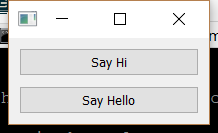

..
  NOTE: This RST file was generated by `make examples`.
  Do not edit it directly.
  See docs/source/examples/example_doc_generator.py

Override Function Example
===============================================================================

An which demonstrates a declarive function override.

This example demonstrates how to use the `=>` operator to override a
declarative function defined with the @d_func decorator.

.. TIP:: To see this example in action, download it from
 :download:`override_function <../../../examples/functions/override_function.enaml>`
 and run::

   $ enaml-run override_function.enaml

Screenshot
-------------------------------------------------------------------------------

Example Enaml Code
-------------------------------------------------------------------------------
.. literalinclude:: ../../../examples/functions/override_function.enaml
    :language: enaml
