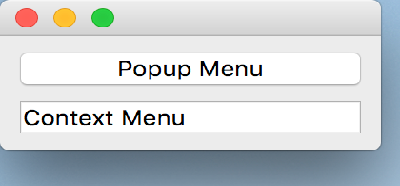

..
  NOTE: This RST file was generated by `make examples`.
  Do not edit it directly.
  See docs/source/examples/example_doc_generator.py

Popup Menu Example
===============================================================================

This example demonstrates how to popup a menu.

A menu can be popped up in 2-ways. The first is by declaring the menu as
a child of a widget and setting the 'context_menu' attribute to True. The
second method is by creating the menu on-demand, and then invoking it's
'popup()' method to show the menu at the current mouse location.

.. TIP:: To see this example in action, download it from
 :download:`popup_menu <../../../examples/widgets/popup_menu.enaml>`
 and run::

   $ enaml-run popup_menu.enaml

Screenshot
-------------------------------------------------------------------------------

Example Enaml Code
-------------------------------------------------------------------------------
.. literalinclude:: ../../../examples/widgets/popup_menu.enaml
    :language: enaml
