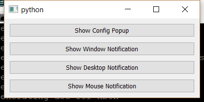

..
  NOTE: This RST file was generated by `make examples`.
  Do not edit it directly.
  See docs/source/examples/example_doc_generator.py

Popup View Example
===============================================================================

This is an example of a fully dynamic PopupView widget.

The PopupView is useful for displaying transient configuration dialogs
and notification windows. The widget supports a transparent background.

.. TIP:: To see this example in action, download it from
 :download:`popup_view <../../../examples/widgets/popup_view.enaml>`
 and run::

   $ enaml-run popup_view.enaml

Screenshot
-------------------------------------------------------------------------------

Example Enaml Code
-------------------------------------------------------------------------------
.. literalinclude:: ../../../examples/widgets/popup_view.enaml
    :language: enaml
