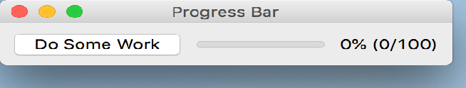

..
  NOTE: This RST file was generated by `make examples`.
  Do not edit it directly.
  See docs/source/examples/example_doc_generator.py

Progress Bar Example
===============================================================================

An example of the 'ProgressBar' widget.

This example demonstrates the use the ``ProgressBar`` widget by hooking
it up to a ``PushButton`` widgets which simulates a work update.

.. TIP:: To see this example in action, download it from
 :download:`progress_bar <../../../examples/widgets/progress_bar.enaml>`
 and run::

   $ enaml-run progress_bar.enaml

Screenshot
-------------------------------------------------------------------------------

Example Enaml Code
-------------------------------------------------------------------------------
.. literalinclude:: ../../../examples/widgets/progress_bar.enaml
    :language: enaml
