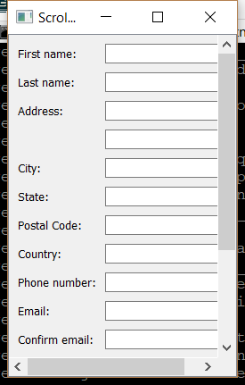

..
  NOTE: This RST file was generated by `make examples`.
  Do not edit it directly.
  See docs/source/examples/example_doc_generator.py

Scroll Area Example
===============================================================================

An example of the ``ScrollArea`` widget.

A ``ScrollArea`` can have at most one child which must be an instance of
``Container``. When to show the scroll bars is determined automatically
based on the sizing constraints of the ``Container``. However, that
policy can be changed through the attributes 'horizontal_scrollbar' and
'vertical_scrollbar'. These attributes can be set to 'as_needed',
'always_on', and 'always_off'. The default is 'as_needed'.

.. TIP:: To see this example in action, download it from
 :download:`scroll_area <../../../examples/widgets/scroll_area.enaml>`
 and run::

   $ enaml-run scroll_area.enaml

Screenshot
-------------------------------------------------------------------------------

Example Enaml Code
-------------------------------------------------------------------------------
.. literalinclude:: ../../../examples/widgets/scroll_area.enaml
    :language: enaml
