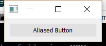

..
  NOTE: This RST file was generated by `make examples`.
  Do not edit it directly.
  See docs/source/examples/example_doc_generator.py

Simple Widget Alias Example
===============================================================================

An example of using an Enaml alias to expose an internal widget.

.. TIP:: To see this example in action, download it from
 :download:`simple_widget_alias <../../../examples/aliases/simple_widget_alias.enaml>`
 and run::

   $ enaml-run simple_widget_alias.enaml

Screenshot
-------------------------------------------------------------------------------

Example Enaml Code
-------------------------------------------------------------------------------
.. literalinclude:: ../../../examples/aliases/simple_widget_alias.enaml
    :language: enaml
